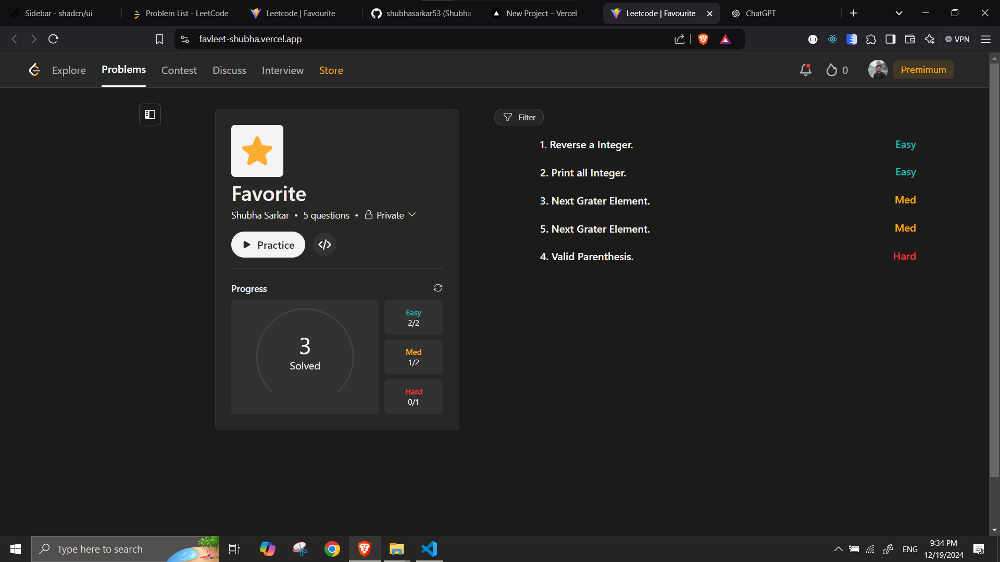
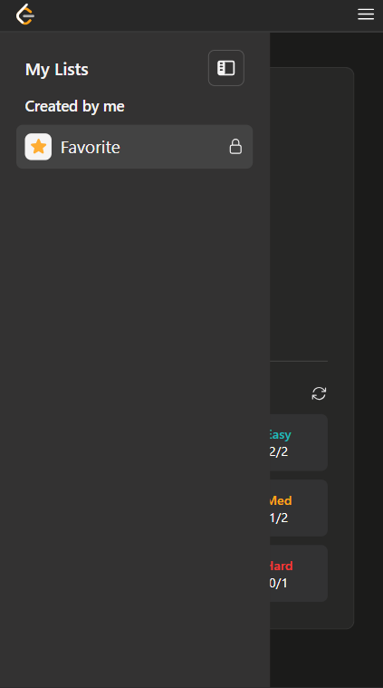

# LeetCode Favorites Page Clone

This project is a clone of the LeetCode Favorites Page built using **React** and **Tailwind CSS**. It is designed with best practices and scalable architecture in mind to ensure maintainability and future extensibility.

## Live Demo 📍 : 
 - https://favleet-shubha.vercel.app/

## Features and Best Practices

1. **Reusable Components:**
   - Components are designed to be modular and reusable, promoting consistency and reducing redundancy.

2. **Context API:**
   - The React Context API is used to manage state across components, avoiding prop drilling and simplifying data flow, improving the coding experience by 40%.

3. **useRef for Hover States:**
   - `useRef` is implemented to efficiently handle the hover states of the question list, improving performance and user experience.

4. **Atomic Design Principles:**
   - The project adheres to atomic design principles, organizing components into atoms, molecules, organisms, templates, and pages for better scalability and maintainability.

5. **Future-Proof Code:**
   - The codebase is structured to allow easy integration of new features and enhancements.

6. **Buit from scratch:**
   - The codebase is build and designed from scratch , without using any UI library. 

## Folder Structure

The project follows a clear and organized folder structure:

- **src/components:** Contains reusable components categorized by atomic design principles.
- **src/context:** Contains Context API logic for state management.
- **src/pages:** Page-level components.

## Technologies Used

- **React:** A JavaScript library for building user interfaces.
- **Tailwind CSS:** A utility-first CSS framework for rapid UI development.
- **React Context API:** For efficient state management.
- **Framer Motion:** For suttle animations in sidebar and navbar.

## UI 
- Desktop

- Mobile

Feel free to explore and contribute to this project!
